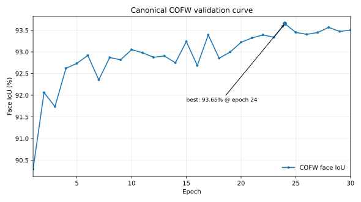

# FaceOcc

**A modernized, reproducible FaceOcc implementation.**

> [!IMPORTANT]
> This repository is a derivative modernization of the original **FaceOcc** implementation for **FaceOcc: A Diverse, High-quality Face Occlusion Dataset for Human Face Extraction** by Xiangnan Yin and Liming Chen. The FaceOcc dataset, original method, U-Net/ResNet18 baseline, and global OHEM-BCE training objective originate from the original authors. This repository focuses on maintaining that method on a current software stack with reproducible training, safer artifacts, automated preparation, richer diagnostics, and corrected implementation semantics.

- **Original paper:** [FaceOcc: A Diverse, High-quality Face Occlusion Dataset for Human Face Extraction](https://arxiv.org/abs/2201.08425)
- **Original repository:** [face3d0725/FaceExtraction](https://github.com/face3d0725/FaceExtraction)
- **Modernization:** Mert Akın ([@mertakinstd](https://github.com/mertakinstd))
- **Canonical model weights:** [mertakin/FaceOcc](https://huggingface.co/mertakin/FaceOcc) on Hugging Face
- **License and attribution:** [LICENSE](LICENSE) · [NOTICE.md](NOTICE.md)

## Scope

FaceOcc predicts the **visible facial surface** of an occluded face as a binary mask:

- `1` — visible face
- `0` — background or occluder

The canonical release intentionally keeps the original model family and training objective rather than replacing them with a new face-segmentation method. Modernization work is limited to the execution, preparation, reproducibility, diagnostics, artifact, and implementation layers required to run the FaceOcc baseline reliably on a current CUDA/PyTorch stack.

## Canonical configuration

| Component | Release configuration |
| --- | --- |
| Architecture | U-Net |
| Encoder | ResNet18, ImageNet pretrained |
| Input | RGB, `256 × 256` |
| Input normalization | ImageNet mean/std after augmentation |
| Output | One-channel visible-face logits |
| Objective | Global OHEM-BCE |
| Optimizer | Adam, initial LR `1e-4` |
| Precision | IEEE FP32 |
| Default seed | `42` |
| Checkpoint selection | Maximum COFW face IoU at `p = 0.5` |
| Checkpoint format | `safetensors` |

## Model weights

The canonical FaceOcc `v1.0.0` checkpoint is available on [Hugging Face](https://huggingface.co/mertakin/FaceOcc). The model repository provides the `safetensors` weights together with the inference configuration, canonical training provenance, and model card.

## What is modernized

The release preserves the canonical FaceOcc modeling contract while updating the surrounding implementation:

- Python 3.12 and a repo-local Micromamba environment.
- PyTorch 2.13 / CUDA 13.2 and `segmentation-models-pytorch` 0.5.0.
- CUDA-only training with explicit IEEE FP32 behavior; no silent CPU fallback.
- Seeded Python, NumPy, PyTorch, CUDA, DataLoader, and augmentation RNGs.
- ImageNet normalization for the pretrained ResNet18 input path.
- Safe `safetensors` checkpoint serialization.
- Automated FaceOcc/CelebAMask-HQ acquisition and validation through `setup.sh`.
- Reproducible 3DDFA_V2-based landmark generation and alignment through `prepare.sh`, with pinned revision and artifact hashes.
- A single canonical training entrypoint through `train.sh`.
- Extended validation diagnostics including IoU distribution statistics, Dice, precision/recall, Boundary IoU, calibration diagnostics, FP/FN statistics, and threshold sweeps.
- Corrected legacy augmentation translation semantics: independent, symmetric per-axis affine translation.
- Corrected metric aggregation semantics: per-image macro metrics with sample-weighted epoch aggregation.

## Installation and data preparation

### Requirements

- Linux x86_64
- NVIDIA GPU and compatible NVIDIA driver
- `curl`, `git`, `tar`, `unzip`, `find`, `stat`, and `sha256sum`

Training is intentionally CUDA-only.

### 1. Configure dataset access

```bash
cp .env.example .env
```

Edit `.env` and set the required download locations. `CelebAMask-HQ` is a third-party dataset; set:

```text
CELEBAMASK_LICENSE_ACCEPTED=1
```

only after reviewing and accepting its terms.

### 2. Create the environment and acquire raw data

```bash
./setup.sh
```

`setup.sh` installs the repo-local Micromamba environment, installs the pinned Python/CUDA stack, validates downloaded archives, and performs dataset preflight checks.

### 3. Reproduce the aligned training data

```bash
./prepare.sh
```

`prepare.sh` fetches the pinned `3DDFA_V2` revision, verifies model artifacts by size and SHA-256, generates facial landmarks, reproduces the FaceOcc alignment path, and verifies the resulting image/mask pairs.

Prepared data are generated locally and are intentionally excluded from Git.

## Training

Run the canonical configuration with:

```bash
./train.sh
```

The default seed is `42`. It can be changed explicitly:

```bash
FACEOCC_SEED=123 ./train.sh
```

A run records:

- `run_config.json` — protocol, environment, device, and reproducibility metadata
- `history.csv` — epoch-level training/validation metrics
- `summary.json` — selected checkpoint and run summary
- `checkpoints/*.safetensors` — model checkpoints

The best checkpoint is selected by COFW visible-face IoU at logit threshold `0`, equivalent to probability threshold `0.5`.

## Canonical reference run

The following values are provided as a **release reference**, not as a comparison against alternative methods. They allow users to check whether a reproduced canonical run is in the expected regime. The reference run was trained on an **NVIDIA GeForce RTX 3060 12 GB** GPU. Runtime measurements are hardware-dependent.



| Metric | Reference value |
| --- | ---: |
| Best epoch | **24 / 30** |
| COFW face IoU @ `p = 0.5` | **0.936523** |
| Dice | **0.966749** |
| Precision | **0.948656** |
| Recall | **0.986324** |
| Boundary IoU | **0.682287** |
| IoU p10 / median / p90 | **0.893731 / 0.945921 / 0.971353** |
| Best optimizer step | **41,688** |
| Peak training VRAM | **1607 MiB** |
| Training compute to selected epoch | **2 h 05 m 46 s** |
| Wall time to selected validation | **2 h 12 m 24 s** |
| Full 30-epoch wall time | **2 h 38 m 11 s** |

The canonical checkpoint criterion remains IoU at `p = 0.5`. A probability-threshold sweep is recorded only as a diagnostic; in this reference run its maximum was `0.944040` at `p = 0.70`.

Machine-readable reference values and the compact epoch history used for the figure are included in [`docs/reference/`](docs/reference/).

## Evaluation

`evaluation_cofw.py` loads the best `safetensors` checkpoint and evaluates the FaceOcc COFW test masks using the canonical input preprocessing path.

```bash
python evaluation_cofw.py
```

COFW is used by the canonical training loop for checkpoint/epoch selection. Additional external benchmarks should therefore be reported separately from the COFW checkpoint-selection metric.

## Reproducibility notes

- Stochastic augmentation remains stochastic across samples and epochs, but the same seed reproduces the same RNG/DataLoader stream under the supported environment.
- Persistent DataLoader workers are intentionally disabled.
- Eligible CUDA FP32 matmul and convolution paths are configured for IEEE FP32 rather than TF32.
- Images are converted to `[0,1]`, augmented, then normalized with ImageNet mean `[0.485, 0.456, 0.406]` and standard deviation `[0.229, 0.224, 0.225]` immediately before model forward.
- Masks are never normalized.
- The canonical primary metric is visible-face IoU at `p = 0.5`; additional metrics are diagnostics.

## Project layout

```text
.
├── Dataset/              # dataset loaders and augmentations
├── face_align/           # alignment/preparation utilities
├── diagnostics.py        # validation diagnostics
├── faceocc_runtime.py    # model/runtime and reproducibility policy
├── loss.py               # canonical losses and metrics
├── train.py              # canonical training program
├── train_utils.py        # train/validation epoch loops
├── evaluation_cofw.py    # COFW evaluation
├── setup.sh              # environment + raw-data setup
├── prepare.sh            # reproducible alignment/preparation
└── train.sh              # canonical training entrypoint
```

## Attribution and citation

If you use the FaceOcc dataset, model design, or original method, cite the original FaceOcc work:

```bibtex
@misc{yin2022faceocc,
  title   = {FaceOcc: A Diverse, High-quality Face Occlusion Dataset for Human Face Extraction},
  author  = {Yin, Xiangnan and Chen, Liming},
  year    = {2022},
  eprint  = {2201.08425},
  archivePrefix = {arXiv},
  primaryClass = {cs.CV}
}
```

Please also retain the upstream attribution required by the MIT License. See [`NOTICE.md`](NOTICE.md) for the distinction between the original FaceOcc work and the modernization in this repository.

If this **modernized implementation** contributes to published work, please also consider citing the software release in addition to the original FaceOcc paper. Citation metadata are provided in [`CITATION.cff`](CITATION.cff). The archived `v1.0.0` software release is identified by DOI [`10.5281/zenodo.22261117`](https://doi.org/10.5281/zenodo.22261117).

> [!NOTE]
> Citing this software implementation does not replace citation of the original FaceOcc work. The scientific method and dataset should continue to be credited to the original authors.

## License

The software is distributed under the MIT License. The upstream copyright notice is preserved in [`LICENSE`](LICENSE); modernization contributions are identified in [`NOTICE.md`](NOTICE.md) and are distributed under the same license.

Third-party datasets and artifacts retain their own licenses and terms. The repository MIT License does **not** alter or supersede the terms under which FaceOcc, CelebAMask-HQ, 3DDFA_V2, or other separately distributed resources are provided.
